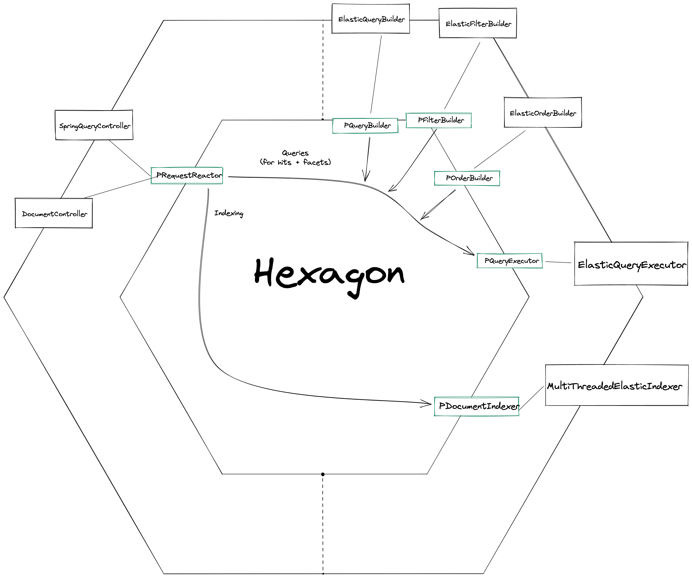

# Spring Boot Exercises
This repository compiles a list of exercises
and projects for the Empathy.co Academy program.

## Hexagonal Architecture
This project is following an hexagonal architecture style, with ports and adapters.
In the following diagram can be seen a brief explanation of the current state of the project:
The Spring controllers send requests, these (for the moment) search requests get thrown about the hexagon,
the query builder adapter injects the query on the request, and then the executor executes it.

## REST API
> **_NOTE_**: This interface is provisional and _WILL_ be changed

- `GET /search?query={param}`: Echoes back `param`, along with the
cluster verison
- `POST /document`: Takes a json as body, and posts it to the search engine
- `GET /genres/`: Takes a list of space-separated strings (the genres) as body, and returns an array of movies that match all of the genres
- `GET /genres/{and}`: The same as `/genres`, but includes the `and` parameter, which allows to select the behaviour of the search. When `true` is passed in, it functions as normal, when `false` is passed in, it changes the match all for a match any, meaning that a movie with only 1 of the genres passed in will be returned
- `GET /intitle`: Returns a list of movies that have the passed-in title string in any of their titles
