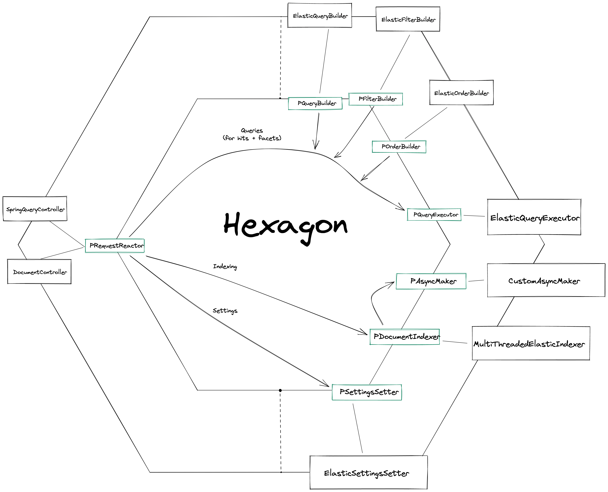

# Spring Boot Exercises
This repository compiles a list of exercises
and projects for the Empathy.co Academy program.

## Hexagonal Architecture
This project is following an hexagonal architecture style, with ports and adapters.
In the following diagram can be seen a brief explanation of the current state of the project:

The Spring controllers send requests, these (for the moment) search requests get thrown about the hexagon.
Inside the hexagon, the query, filter and ordering builders build each its own thing, and the hexagon bundles
it all up before passing it down to the query executor, which executes the query.

The controllers also can send document requests, to index a file. These are barebones for the moment and just pass the 
data down to the document indexer.

## REST API
- `GET /search/`: Returns the hits that match the criteria specified in the filters. It has a bunch of paramters:
    - genres - Title genres. Multiple genres should be sent separeted by commas (e.g genres=Action,Sci-Fi).
    - type - Title type. Values send in the same way as genres parameter.
    - maxYear - Maximun start year
    - minYear - Miniumn start year
    - maxMinutes - Maximun runtime minutes
    - minMinutes - Minimun runtime minutes
    - maxScore - Maximun average rating
    - minScore - Minimun average rating
    - maxNHits - Upper bound of the number of hits returned
    - sortRating - (asc/desc) The ordering of the sort. asc = worst rated first.
- `GET /search`: Alias for `GET /search/`
- `POST /document`: Takes a jsons as MultiPartRequest parameters, and indexes them. The parameters are:
    - basics - File containing the basics information (title.basics.tsv)
    - ratings - File containing the ratings information (title.ratings.tsv)
    - akas - File containing the ratings information (title.rating.tsv)
    - principals - File containing the principals information (title.principals.tsv)
    - crew - File containing the crew information (title.crew.tsv)
    - episodes - File containing the episodes information (title.episode.tsv)
    > **_NOTE_**: The files directly downloaded from IMDb are NOT properly sorted, and the system does not sort them by itself. Non-properly-sorted files will result in non-properly-indexed 
	indices

> **_NOTE_**: The remaining endpoints from here are non-standard to the academy project
- `GET /genres/`: Takes a list of space-separated strings (the genres) as body, and returns an array of movies that match all of the genres
- `GET /genres/{and}`: The same as `/genres`, but includes the `and` parameter, which allows to select the behaviour of the search. When `true` is passed in, it functions as normal, when `false` is passed in, it changes the match all for a match any, meaning that a movie with only 1 of the genres passed in will be returned
- `GET /intitle`: Returns a list of movies that have the passed-in title string in any of their titles
